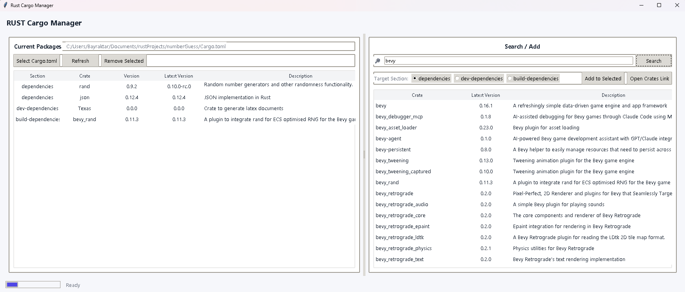

# Rust Cargo Manager (Python GUI)

A simple **Cargo.toml dependency manager** built with Tkinter. It lets you select a Rust project's `Cargo.toml`, search crates on crates.io, add them to the relevant sections (`dependencies`, `dev-dependencies`, `build-dependencies`), or remove existing ones. The app fetches the **latest version** and **short description** of each crate via the crates.io API. Source code: `cargoManager.py`.

> Note: The app writes directly to your `Cargo.toml`. It automatically creates a `.backup` file as a safety copy.

---

## Features

- Select and parse `Cargo.toml`
- List sections: `dependencies`, `dev-dependencies`, `build-dependencies`
- Search crates.io, open selected crate page in browser
- Add selected crate to chosen section
- Remove existing crate
- Status bar and progress indicator
- Automatic backup (`Cargo.toml.backup`)

---

## Screenshots

Here are some screenshots of the application in action:

### Main Window


---

## Installation

### 1) Python version
- Python 3.9+ recommended

### 2) Install dependencies
From `requirements.txt`:
```bash
pip install -r requirements.txt
```

> `tkinter` ships with Python. On some Linux distros, you may need to install it via your package manager (e.g., Ubuntu/Debian: `sudo apt install python3-tk`).

### 3) Run the app
```bash
python cargoManager.py
```

---

## Usage

1. Click **Select Cargo.toml** and choose a Rust project file.
2. Left panel shows existing dependencies (section, name, current version, latest version, description).
3. In the right panel, enter a search term and press **Search**.
4. Pick a result; choose the target section (`dependencies`, `dev-dependencies`, `build-dependencies`), then **Add to Selected**.
5. To remove a dependency, select it from the left panel and press **Remove Selected**.
6. Use **Open Crates Link** to open the selected crate’s crates.io page.

> Changes are written directly to `Cargo.toml` and a `.backup` is created.

---

## Architecture & Technical Notes

- GUI: `tkinter` + `ttk`
- HTTP requests: `requests`
- TOML read/write: `toml`
- Uses crates.io REST API directly
- Main class: `CargoManager` (inherits from `tk.Tk`)
- Progress bar shows network request delays for large dependency lists

---

## Development

Using a virtual environment:
```bash
python -m venv .venv
source .venv/bin/activate  # Windows: .venv\Scripts\activate
pip install -r requirements.txt
```

For code quality, consider adding: `ruff`, `black`

---

## Packaging (optional)

You can build a standalone executable with `pyinstaller`:
```bash
pip install pyinstaller
pyinstaller --noconfirm --onefile --windowed cargoManager.py
```
The binary will be inside `dist/`.

---

## Author

Developed by [İbrahim Turhan Bayraktar](https://github.com/turhan38)